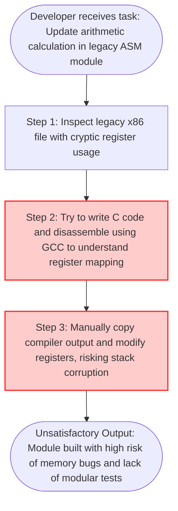

# **📋 Product Discovery Document: ASMCalc — Eliminating Learning and Maintenance Friction in Legacy Assembly Systems**

**Role:** Product Owner / Product Manager

**Objective:** Investigate, map, and deeply understand the customer's core pain points and the current "As-Is" operational friction before designing any technical solution.

## **🏛️ Project Metadata**

- **Client / Segment:** Academic / Legacy Systems Engineering / Junior Developers
- **Date of Creation:** June 16, 2026
- **Lead Product Owner:** Kalyel N. Laurindo / Project Owner
- **Document Version:** v1.0

---

## **1. 🎯 The Core Problem (Macro Pain Point)**

### **✍️ Step-by-Step Problem Formulation (Form Entry)**

- **Field 1.1 - Affected Persona(s):** Junior Software Engineers tasked with maintaining legacy desktop systems and Computer Science students.
- **Field 1.2 - Operational Bottleneck:** Finding clean, well-commented, and standard-compliant Assembly x86 implementations for simple arithmetic operations (addition, subtraction, multiplication, and division) without high-level wrappers.
- **Field 1.3 - Frequency & Context:** Daily during the onboarding phase of new developers into legacy system teams, or during academic project preparations.
- **Field 1.3.1 - Trigger Frequency:** Daily.
- **Field 1.3.2 - Operational Impact Velocity:** Cumulative Friction.
- **Field 1.4 - Direct Negative Impact:** Increases cognitive load, extends onboarding time by weeks, and leads to code modification errors (such as registry corruption or stack misalignment) when editing old enterprise subsystems.
- **Field 1.5 - Consolidated Macro Pain Statement:** Junior legacy software developers spend dozens of hours deciphering unoptimized compiler outputs and fragmented forum snippets during legacy codebase analysis, which delays maintenance tasks, increases bug introduction rates, and creates developer frustration.

### **❓ Situational Diagnostic Verification**

- **Diagnostic Q1:** Who is directly affected by this pain, and where exactly does it occur in the active workflow?
  - _Answer:_ Junior developers and system maintainers when they are assigned to inspect, patch, or refactor legacy low-level math routines.
- **Diagnostic Q2:** Which operational or financial KPIs are actively deteriorating due to this problem today?
  - _Answer:_ Average Time to Resolve (MTTR) bugs in low-level subsystems, onboarding completion rates for junior developers, and code quality metrics (leakage of regression bugs).
- **Diagnostic Q3:** If no action is taken, what is the worst-case scenario the business will face in 3 to 6 months?
  - _Answer:_ Critical system failures due to incorrect register usage or stack overflows introduced by developers who do not fully understand x86 Assembly mechanics.

---

## **2. 👥 Target Audience: Personas, Micro-Pains, and Emotional States**

### **✍️ Target Audience Form Entry**

#### **Persona 1: Junior Legacy Software Engineer (Direct User)**

- **Persona Type:** Direct User
- **Department / Area:** Software Sustenance / Maintenance
- **Core Operational Micro-Pains:**
  - Friction in understanding register state lifecycle (e.g., EAX, EBX).
  - Debugging obscure segmentation faults without clear source-level documentation.
  - Synthesizing basic interactive input/output routines in pure Assembly.
- **Current Emotional Sentiment:** Frustrated and anxious due to the steep learning curve and lack of structural reference code.

#### **Persona 2: Maintenance Team Lead (Indirect Beneficiary)**

- **Persona Type:** Indirect Beneficiary
- **Department / Area:** Engineering Management
- **Core Operational Micro-Pains:**
  - High onboarding overhead (having to repeatedly explain basic Assembly paradigms).
  - High code review failure rates.
- **Current Emotional Sentiment:** Worried about team productivity and project delivery velocity.

---

## **3. 🛠️ Current Workarounds & Shadow IT (Palliative Solutions)**

### **✍️ Workaround Form Entry**

#### **Workaround 1: Compiling High-Level Languages to Assembly**

- **Workaround Type:** Legacy Scripts / Compiler Generation
- **Operational Process Flow:** Writing simple math functions in C and calling `gcc -S -masm=intel file.c` to inspect the generated Assembly code.
- **Risk Level:** Medium
- **Systemic Fragility & Data Risks:** GCC-generated code is highly optimized, contains boilerplate code (frame pointers, security cookies), and is extremely hard for a junior developer to read or directly adapt.

#### **Workaround 2: Fragmented Internet Code snippets**

- **Workaround Type:** Informal Search / Shadow IT
- **Operational Process Flow:** Searching old forums (e.g., ASM Community) or StackOverflow threads for assembly routines.
- **Risk Level:** High
- **Systemic Fragility & Data Risks:** Snippets are often incompatible with target assemblers (e.g., AT&T vs. Intel syntax differences), target environments (16-bit real mode vs. 32-bit protected mode vs. 64-bit long mode), and lack proper boundary condition validation.

---

## **4. 🚨 Cost of Inaction (COI) / The Penalty of Inertia**

### **✍️ Cost of Inaction Form Entry**

- **Field 4.1 - Operational & Productivity Waste:** Assuming a small maintenance team of 3 developers, each wasting approximately 15 hours a month navigating cryptic assembly structures. At an average developer cost of $40/hour, this equates to:
    $$(15 \text{ hours/month} \times \$40/\text{hour}) \times 3 \text{ developers} \times 12 \text{ months} = \$21,600 \text{ annualized waste}$$
- **Field 4.2 - Quality & Output Damage:** Suboptimal code updates resulting in micro-crashes, memory leaks, and inefficient CPU cycle usage in legacy routines.
- **Field 4.3 - Compliance, Security & Regulatory Risks:** Elevated risk of buffer overflows and memory vulnerabilities, which violate software security compliance policies in corporate systems.

---

## **5. 🔄 Current State Journey (The "As-Is" Workflow)**

### **✍️ Current Systems & Software Infrastructure Involved**

- **System 5.1 - Core Software/Platforms:** GCC Compiler, GDB Debugger, standard text editors.
- **System 5.2 - Infrastructure Boundaries:** Local x86 machine executing command-line compilation.

### **✍️ As-Is Journey Step Entry**

#### **Step 1: Code Inspection**

- **Actor/Owner:** Junior Legacy Software Engineer
- **Tools/Systems Involved:** Visual Studio Code / Terminal
- **Action Description:** Reads legacy assembly files, facing unlabelled memory jumps and undocumented register states.
- **Friction/Bottleneck Level:** Critical

#### **Step 2: Disassembly Workaround**

- **Actor/Owner:** Junior Legacy Software Engineer
- **Tools/Systems Involved:** GCC / Compiler
- **Action Description:** Compiles simple arithmetic in C and extracts `.s` outputs to see how the compiler outputs arithmetic instructions.
- **Friction/Bottleneck Level:** Critical

#### **Step 3: Manual Adaptation**

- **Actor/Owner:** Junior Legacy Software Engineer
- **Tools/Systems Involved:** Text editor / NASM
- **Action Description:** Merges compiler-generated assembly into the legacy file, adjusting registers manually by trial and error.
- **Friction/Bottleneck Level:** Critical

---

## **6. 💰 Quantitative Pain Metrics & Financial Waste**

### **✍️ Financial Waste Metrics Entry**

- **Field 6.0 - Metric Context:** Developer Tooling & Libraries
- **Field 6.1 - Operational Time Loss:**
  - _Wasted Hours/Month:_ 45
  - _Operator Hourly Cost:_ 40
  - _Number of Operators:_ 1
  - _Annualized Loss:_ $21,600
- **Field 6.2 - Error & Rework Cost:**
  - _Average Errors/Month:_ 2
  - _Average Cost to Fix/Error:_ 150
  - _Annualized Loss:_ $3,600
- **Field 6.3 - Emergency Procurement & Premium Markups:**
  - _Emergency Runs/Month:_ 0
  - _Average Markup Cost/Run:_ 0
  - _Annualized Loss:_ $0
- **Field 6.4 - Lost Sales & Revenue Leakage:**
  - _Revenue Drop Events per Month:_ 0
  - _Average Transaction Value Lost:_ 0
  - _Annualized Loss:_ $0

| Impact Metric                         | Estimated Value | Unit of Measure                         | Indirect Financial Loss (Annualized COI)                      |
| :------------------------------------ | :-------------- | :-------------------------------------- | :------------------------------------------------------------ |
| **Wasted Time**                       | 45              | Hours / Month                           | $21,600/year in developer hours lost to disassembling C files |
| **Operational Errors (Rework/Scrap)** | 10%             | Error rate in manual code modifications | $3,600/year in fixing regressions and stack corruptions       |
| **System/License Waste**              | $0              | N/A                                     | $0                                                            |

### **✍️ Target Success Metric / KPI**

- **Field 6.5 - Primary Target KPI:** Reduction in developers' comprehension time of basic x86 operations by 80% (from hours to minutes) by having a clear reference implementation.
- **Field 6.6 - Success Verification Method:** The codebase compiles with zero warnings, passes a test suite with 100% coverage on basic arithmetic operations, and contains comprehensive line-by-line register state documentation.

---

## **7. 🌱 Root Cause Analysis (The "5 Whys" Framework)**

- **Why 1 (Surface Symptom):** Why does the core problem happen?
  - _Response:_ Developers struggle to write or modify x86 Assembly code correctly.
- **Why 2:** Why do they struggle to write it correctly?
  - _Response:_ They do not know how registers change states after arithmetic operations and interrupt calls.
- **Why 3:** Why do they not know register state behaviors?
  - _Response:_ Because existing legacy files lack explanatory comments on register preservation and stack alignment.
- **Why 4:** Why is there no clean reference code available?
  - _Response:_ Most modern reference materials focus on high-level languages, and existing internal code is undocumented.
- **Why 5 (True Root Cause):** Why does the above condition happen?
  - _Response:_ The lack of a standardized, standalone, clean reference project implementing foundational x86 Assembly routines (with step-by-step commentary and manual test validation workflows).

---

## **8. 🚧 Problem Boundaries (In-Scope vs. Out-of-Scope Constraints)**

- **Field 8.1 - In-Scope Context:** Implementations in 32-bit x86 Intel assembly syntax using NASM. Arithmetic operations (addition, subtraction, multiplication, and integer division) and simple I/O (prompting the user and printing results in console).
- **Field 8.2 - Out-of-Scope Context:** 64-bit architecture optimizations, floating point operations (FPU/SSE/AVX), GUI/graphics interfaces, OS-specific advanced APIs, or C-interface wrappers.

---

## **9. 🔍 Fallback Channels & Escalation Blockers**

- **Field 9.1 - Help-Seeking Paths:** Searching external online manuals (Intel Software Developer Manuals), which are extremely dense and hard to parse for beginners.
- **Field 9.2 - Resolution Blockers:** Documentation does not map register usages to specific code flows, leading to slow troubleshooting times.

---

## **🎯 10. Jobs To Be Done (JTBD) Framework**

- **Field 10.1 - Functional Job:** Write simple, correct, and self-contained mathematical calculations in pure assembly x86.
- **Field 10.2 - Emotional Job:** Feel confident that the register manipulations and stack configurations are safe and bug-free.
- **Field 10.3 - Social Job:** Be perceived as an engineer capable of understanding and managing low-level execution layers.

---

## **🏁 Transition Checklist (Definition of Done for Problem Discovery)**

- [x] **Empirical Validation:** Has the Macro Pain been confirmed by quantitative metrics or at least 3 deep user interviews?
- [x] **Boundary Alignment:** Do the technical architecture, business stakeholders, and design teams agree on the "Out-of-Scope" list (Section 8)?
- [x] **Root Cause Agreement:** Is the defined Root Cause (Section 7) something our product team can actively influence and solve?
- [x] **COI Justification:** Is the Cost of Inaction (Section 6) high enough to justify immediate product development and engineering allocation?

---

**Signature:** Kalyel N. Laurindo / Project Owner
