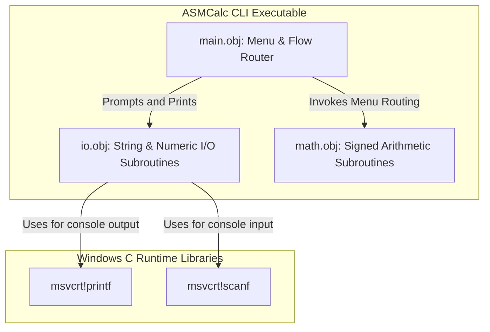

# **📋 Software Design Document: ASMCalc — x86 Assembly CLI Calculator Design**

**Role:** Project Owner / System Architect

**Objective:** Detail the technical implementation, architectural patterns, frameworks, and deployment topologies required to execute the business vision.

## **🏛️ Project Metadata**

- **Client / Segment:** Academic / Legacy Systems Engineering / Junior Developers
- **Date of Creation:** June 16, 2026
- **Lead Architect:** Kalyel N. Laurindo / Software Engineer
- **Document Version:** v1.0

---

## **🛠️ 1. Technical Stack Overview**

### **1.1. Core Architectural Layers Form**

- **Field 1.1.1 - Frontend / Client Stack:**
  - _Technology/Framework:_ Windows Command Prompt (CLI Console View).
  - _Technical Rationale:_ Offers zero UI overhead and focuses entirely on console standard stream I/O.
- **Field 1.1.2 - Backend Core Stack:**
  - _Technology/Framework:_ 32-bit Intel x86 Assembly (Protected Mode), Netwide Assembler (NASM) compiler, and MinGW GCC (`gcc -m32`) as the linker.
  - _Technical Rationale:_ Guarantees raw low-level memory and instruction control while maintaining standard execution formats.
- **Field 1.1.3 - Database & Storage Engines:**
  - _Technology/Framework:_ Local CPU registers (EAX, EBX, ECX, EDX, ESI, EDI) and Thread Stack Frames.
  - _Technical Rationale:_ Immediate register execution speed with zero external database dependencies.
- **Field 1.1.4 - Message Brokers & Queue Managers:**
  - _Technology/Framework:_ N/A
  - _Technical Rationale:_ Direct synchronous command execution.
- **Field 1.1.5 - Gateway, Infrastructure & Orchestration:**
  - _Technology/Framework:_ GNU Make (Makefile) for automated compilation and linking stages.
  - _Technical Rationale:_ Standard build tool present in GCC development environments.
- **Field 1.1.6 - Observability & Telemetry:**
  - _Technology/Framework:_ GDB (GNU Debugger) or Visual Studio Debugger for register inspection.
  - _Technical Rationale:_ Industry standard for examining CPU register state and call stack.

### **1.2. Technical Traceability Matrix**

#### **Traceability Entry 1: Wasted Time Decoding Boilerplate Compiler Code**

- **System Requirement ID:** RF01, RF02
- **Responsible Technical Module:** `src/math.asm`, `src/io.asm` (human-readable, highly commented assembly subroutines).

#### **Traceability Entry 2: Register Corruption & General Instability**

- **System Requirement ID:** RF01, RF03
- **Responsible Technical Module:** **cdecl** calling convention template wrappers in all subroutines.

---

## **🏗️ 2. Architectural Design & Core Patterns**

- **Field 2.1 - Core Architectural Pattern:** Standalone Utility

### **💡 Architectural Pattern Details**

The codebase will be divided into modular files containing specific subroutines, compiled separately to `.obj` object files, and linked into a final PE binary using GCC.

```text
[User Terminal]
       │
       ▼
 ┌──────────┐      Calls       ┌──────────┐
 │ src/main │────────────────> │  src/io  │ (atoi, itoa, read_str, print_str)
 └──────────┘                  └──────────┘
       │                             ▲
       │ Calls                       │ Utilizes registers
       ▼                             │
 ┌──────────┐                        │
 │ src/math │────────────────────────┘ (add, sub, imul, idiv)
 └──────────┘
```

- **Field 2.3 - Dependency Inversion & Event Dispatching:** N/A (Procedural low-level code).

---

## **🔐 3. Security Architecture & Data Protection**

- **Field 3.1 - Data In Transit Protocol:** Local In-Memory Communication
- **Field 3.2 - Data At Rest Encryption Standard:** N/A (No persistent data storage)
- **Field 3.3 - Password & Key Derivation Function:** N/A
- **Field 3.4 - Access Delegation Protocol:** CLI Permission Guards
- **Field 3.5 - Emergency Recovery Policy:** N/A

---

## **📐 5. System Component Diagram**

- **Field 5.1 - Component Diagram Visualization:**



---

## **📂 6. Data Architecture (In-Memory Layout)**

- **Field 6.1 - Primary Database Schemas:** Data is structured in the `.data` and `.bss` PE sections:
  - `.data` section: Stores constant prompt strings, menu displays, and static messages.
  - `.bss` section: Reserves local buffer spaces (e.g., 64-byte input buffer for user input digits).
- **Field 6.2 - Indexing & Optimization Strategy:** Memory is aligned to 4-byte boundaries (using `align 4` directive in NASM) to ensure fast 32-bit register access.
- **Field 6.3 - Database Automation & Lifecycle Events:** N/A

---

## **🚀 7. Continuous Integration, Deployment & QA**

- **Test-Driven Development (TDD) Cycle:** Implemented via a separate test harness script (`tests.bat` or `tests/`) that executes the CLI with predefined pipe inputs and asserts the console outputs (comparing them to expected arithmetic values).
- **Test Isolation Pyramid:**
  - **Unit Tests:** Local subroutines (like `atoi` and arithmetic helpers) can be tested by linking them into a C-based test runner (`tests/unit_tests.c`) and comparing outputs.
  - **Integration/E2E Tests:** End-to-end command-line pipe tests.

---

## **📂 11. Codebase Structure & Directory Standards**

- **Field 11.1 - Directory Strategy:** Flat Directory

### **💡 Directory Layout Entry**

- **Field 11.2 - Codebase Directory Tree:**

```
ASMCalc/
├── context/                   # Architecture & Discovery specs
│   ├── backlog/               # Task files (TSK-01.md, etc.)
│   ├── Problem Discovery - ASMCalc.md
│   ├── Solution Architecture - ASMCalc.md
│   ├── Software Design - ASMCalc.md
│   ├── Implementation Flow - ASMCalc.md
│   └── Quick Start - ASMCalc.md
│
├── src/                       # Assembly source codes
│   ├── main.asm               # Entry point & Menu loop
│   ├── math.asm               # Arithmetic routines
│   └── io.asm                 # Standard stream & ASCII parsing routines
│
├── Makefile                   # GNU Make compiler/linker instructions
├── README.md                  # Developer manual
├── claude.md                  # AI Assistant reference guide
└── .gitignore                 # Excludes .obj and .exe artifacts
```

---

## **🧪 12. Validation Strategy & Testing Matrix**

- **Field 12.1 - Unit Testing Framework & Targets:** C test harness (`tests/unit_tests.c`) linking compiled `math.obj` and `io.obj` directly.
- **Field 12.2 - Integration Testing Framework & Targets:** Windows Batch script CLI pipeline checks (`tests/e2e_tests.bat`).
- **Field 12.3 - End-to-End Testing Framework & Targets:** N/A

---

## **📝 13. Architecture Decision Records (ADR)**

- **ADR-001 (Calling Convention Selection):** Standard **cdecl** calling convention is used. Caller cleans the stack, parameters are pushed right-to-left, and EAX returns 32-bit values. This makes calling Assembly from C test runners seamless.
- **ADR-002 (C Runtime Dependency):** Link against `msvcrt.dll` to access stable, standard input/output routines (`printf`, `scanf`, `fgets`) instead of implementing raw OS-specific syscall interrupts (like Win32 API `WriteFile` or `ReadFile`), which would clutter the code.

---

## **🏛️ 14. Code Governance & Naming Standards**

- **Field 14.1 - Domain Entity Naming Style:** N/A
- **Field 14.2 - Value Object Naming Style:** N/A
- **Field 14.3 - Ports & Interfaces Prefix/Suffix:** All subroutine names must use lowercase snake_case (e.g., `atoi_conv`, `math_add`).
- **Field 14.4 - Adapters Suffix:** N/A

---

## **🛡️ 15. Resilience & Disaster Recovery Plan (DRP)**

- **Rule 15.1 - Atomic State Mutations (Write Isolation):** N/A
- **Rule 15.2 - Auto-Healing Schema Validation:** Overflow checks are performed on user input strings to avoid buffer overflows (using bounds-checked input functions like `fgets`).
- **Rule 15.3 - Backup and Database Replication Strategy:** N/A
- **Rule 15.4 - Queue & Job Persistence Strategy:** N/A

---

**Signature:** Kalyel N. Laurindo / Software Engineer
