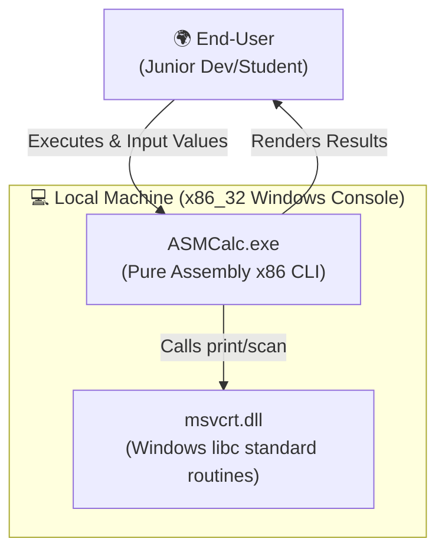
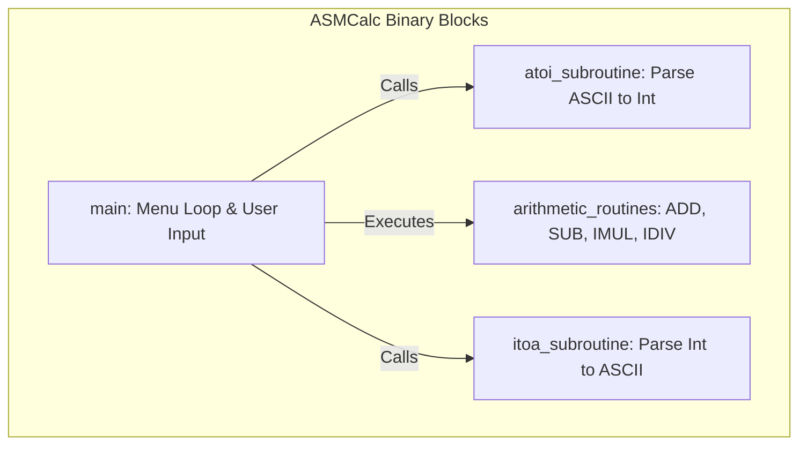

# **📋 Solution Architecture & Product Vision: ASMCalc — Pure x86 Assembly CLI Calculator**

**Role:** Product Owner / Solution Architect

**Objective:** Define the strategic, commercial, and technical blueprint for resolving the core problem space mapped during discovery.

## **🏛️ Project Metadata**

- **Client / Segment:** Academic / Legacy Systems Engineering / Junior Developers
- **Date of Creation:** June 16, 2026
- **Lead Product Owner:** Kalyel N. Laurindo / Project Owner
- **Document Version:** v1.0

---

## **🚀 1. The Market Opportunity & Strategic Positioning**

### **1.1. Market Size & Opportunity Map (TAM / SAM / SOM)**

- **Field 1.1.1 - Total Addressable Market (TAM):** Global population of student developers and software engineers learning computer organization or maintaining legacy assembly systems (estimated 500,000+ developers globally).
- **Field 1.1.2 - Serviceable Addressable Market (SAM):** Developers and students specifically working with x86 Intel architectures and NASM assemblers (estimated 50,000+ developers/students annually).
- **Field 1.1.3 - Serviceable Obtainable Market (SOM):** Students and junior engineers using the Software Engineering Portfolio legacy systems catalog as a primary reference (target: 100+ active repository references in Year 1).

### **1.2. Competitive Landscape & Product Moat**

- **Competitor 1 (Compiler-Generated Assembly):** GCC / Clang output (`gcc -S`).
  - _The Gap / Friction Point:_ Hard to read, filled with compiler optimization noise and boilerplate.
  - _Our Advantage:_ Clean, human-written, line-by-line annotated Intel-syntax assembly.
- **Competitor 2 (Online Forum Snippets):** Scattered StackOverflow and old ASM forum code.
  - _The Gap / Friction Point:_ Often buggy, incomplete, and platform-specific (often 16-bit DOS or 64-bit Linux).
  - _Our Advantage:_ Standardized 32-bit Windows Console (Win32 PE) executable codebase utilizing simple libc calls through GCC.

---

## **💰 2. Monetization Strategy, Licensing & Distribution Model**

- **Field 2.1 - Licensing Model:** Permissive Open-Source (MIT/Apache)
- **Field 2.2 - Pricing / Business Model:** Free & Open Source (FOSS) / No Monetization
- **Field 2.2.1 - Paid Tier Value Proposition (If Applicable):** N/A - Fully Free/Open Source
- **Field 2.3 - Distribution Strategy:** Standalone Binary / Source Code Repository
- **Field 2.4 - Organic Acquisition & Growth Strategy:** Academic and professional sharing via GitHub portfolio pages.

---

## **🛠️ 3. Technical Viability & High-Level Architectural Vision**

### **✍️ Technical Challenges Form Entry**

#### **Technical Challenge 3.1: Text-to-Integer and Integer-to-Text Conversion**

- **Friction Level:** High
- **Architectural Solution:** Standard CLI inputs are ASCII strings. We must implement explicit modular assembly subroutines (`atoi` and `itoa`) to parse decimal characters to numeric binary values and vice versa.

#### **Technical Challenge 3.2: Register Exhaustion & Call Convention Safety**

- **Friction Level:** Medium
- **Architectural Solution:** Enforce the standard **cdecl** calling convention for internal procedures, utilizing the stack (`push`/`pop`/`ebp` frame pointers) to pass parameters and preserve registers (`ebx`, `esi`, `edi`).

#### **Technical Challenge 3.3: Cross-Compilation & Linker Setup on Windows**

- **Friction Level:** Medium
- **Architectural Solution:** Use NASM to compile to standard Win32 Object Format (`nasm -f win32`) and leverage GCC (`gcc -m32`) as the linker to resolve Windows standard library calls (like `printf` and `scanf`).

### **3.1. Core Architectural Premises**

- **Decoupling Content/Configuration from Code:** System prompt/CLI text strings are isolated in the `.data` section to facilitate modifications.
- **Offline-Resilience:** The tool is a standalone local CLI executable requiring no network connectivity.
- **Privacy-First Data Protection:** N/A - calculations are performed entirely in local registers and RAM with no data persisting.

### **✍️ Technology & Data Governance Spec**

- **Field 3.4.1 - Core Communication Style:** Local Direct Execution
- **Field 3.4.2 - Data Serialization Format:** Native In-Memory Objects
- **Field 3.5.1 - Database Paradigm:** In-Memory
- **Field 3.5.2 - Primary Source of Truth:** User client local execution registers.

---

## **📑 4. Requirements Engineering & Feature Specification**

### **🎭 4.1. Scenario-Based Requirements Engineering (SBRE)**

#### **Scenario A: Executing basic arithmetic**

- **Trigger Event:** User runs `ASMCalc.exe` in the command prompt.
- **System Action:** System displays a menu (Sum, Sub, Mult, Div, Exit), waits for selection, prompts for two operands, computes the result in Assembly registers, formats it back to ASCII, and prints it.

#### **Scenario B: Division by Zero Fallback**

- **Trigger Event:** User inputs `0` as the divisor during a division operation.
- **System Action:** System detects the zero value prior to executing the `div` instruction to prevent hardware exception, prints a warning message, and returns to the menu.

---

## **🎯 4.2. MoSCoW Prioritization Framework**

#### **🔴 Must Have (Critical for Core Value Proposition & MVP Launch)**

- **Requirement RF01: Addition & Subtraction Core Subroutines**
  - _Description:_ High-performance arithmetic calculation routines using `add` and `sub` x86 opcodes.
  - _JTBD Tracing:_ [Field 10.1 - Functional Job](file:///D:/Software%20Projects/Portifolio/18-sistemas-legados/ASMCalc/context/Problem%20Discovery%20-%20ASMCalc.md)
- **Requirement RF02: Console Input/Output Handlers**
  - _Description:_ Reading keyboard strings and formatting numeric results back to decimal ASCII console outputs.
  - _JTBD Tracing:_ [Field 10.1 - Functional Job](file:///D:/Software%20Projects/Portifolio/18-sistemas-legados/ASMCalc/context/Problem%20Discovery%20-%20ASMCalc.md)

#### **🟡 Should Have (High Value, Target for Immediate Post-MVP Release)**

- **Requirement RF03: Multiplication & Division Modules**
  - _Description:_ Implement signed multiplication (`imul`) and division (`idiv`) instructions with boundary safety guards.
  - _JTBD Tracing:_ [Field 10.1 - Functional Job](file:///D:/Software%20Projects/Portifolio/18-sistemas-legados/ASMCalc/context/Problem%20Discovery%20-%20ASMCalc.md)

#### **🟢 Could Have (Desirable, Nice-to-Have, Low Urgency)**

- **Requirement RF04: Negative Number Support**
  - _Description:_ Format, read, and display negative signed integers.
  - _JTBD Tracing:_ [Field 10.2 - Emotional Job](file:///D:/Software%20Projects/Portifolio/18-sistemas-legados/ASMCalc/context/Problem%20Discovery%20-%20ASMCalc.md)

---

## **⚙️ 5. Non-Functional Requirements (NFRs)**

- **NFR01 (Memory Overhead):** RAM footprint under 5MB during runtime execution.
- **NFR02 (Portability):** Runs on Windows 7 through Windows 11 under command prompt natively.
- **NFR03 (Dependency Limit):** Zero external DLLs needed besides standard Windows/GCC runtime DLLs (e.g., `msvcrt.dll`).
- **Field 5.6 - Target Deployment Architecture:** Local Standalone Binary

---

## **📦 6. MVP Scope Boundary (Defining the Line in the Sand)**

### **6.1. Product Focus Area (MVP Scope)**

- **Target Segments:** Junior engineers and students learning x86 Assembly.
- **Key Flows Included:** Launch program, menu navigation, addition, subtraction, multiplication, division with division-by-zero check.

### **6.1.1. FinOps & Operational Constraints**

- **Field 6.3 - Projected Monthly Infrastructure Cost (MVP):** $0 (Runs locally).

### **6.2. Explicitly OUT of Scope (Post-MVP Backlog)**

- ❌ **Out-of-Scope Feature 1:** Floating point math (dec/fractions).
- ❌ **Out-of-Scope Feature 2:** Interactive graph rendering in CLI.

---

## **🎯 7. Validation Strategy & Success Metrics**

### **7.1. North Star Metric**

- **Field 7.1.1 - North Star Metric Statement:** A developer can clone the repository, run `make` (or compile manually), and test all 4 operations in less than 90 seconds.

---

## **🎨 8. System Architecture Visualization**

- **Field 8.0 - Diagram Strategy:** Local Utility CLI

### **💡 Architecture Diagrams Entry**

- **Field 8.1 - Level 1 System Context Diagram (Mermaid):**

- **Field 8.2 - Level 2 Container Diagram (Mermaid):**

---

## **⚠️ 9. Engineering Risks & Architecture Assumptions**

- **Engineering Risk 9.1: Register Clashing / Corruption**
  - _Severity Level:_ High
  - _Mitigation Strategy:_ Enforce rigid function call conventions, push/pop register preservation macros, and maintain clean Stack Frames using standard `push ebp` / `mov ebp, esp` boilerplate.
- **Architecture Assumption 1:** The developer's environment has MinGW GCC installed for 32-bit linking.

---

**Signature:** Kalyel N. Laurindo / Project Owner
